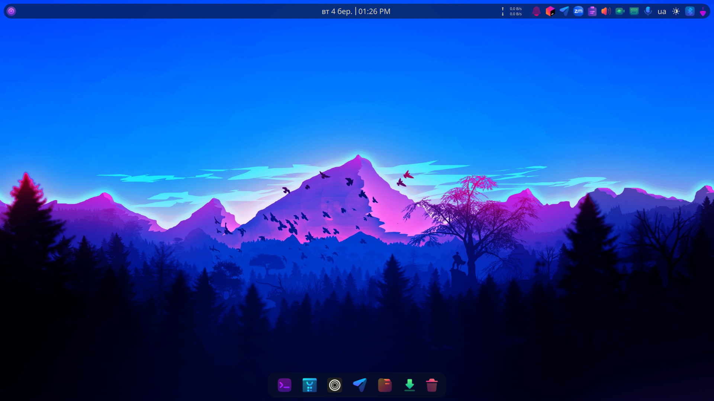
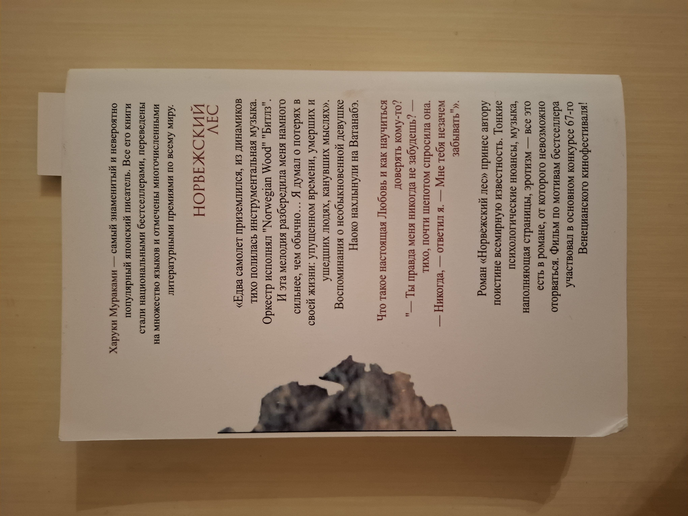

# 📊 Звіт: Оптимізація зображень

---
## Опис початкових зображень
|        Тип зображення         | Формат | Розмір файлу |
|:-----------------------------:|:------:|:------------:|
|             Фото              |  JPG   |   11.2 MB    |
|          ️ Скріншот           |  PNG   |   1.21 MB    |
| Графічне зображення з текстом |  JPG   |   3.32 MB    |

## Зображення:

*Фото*

*Скріншот*

*Графічне зображення з текстом*

## 📈 Порівняння розмірів файлів після різних типів стиснення

### Стиснення без втрати якості (lossless)
|     Формат      |  Фото   | ️ Скріншот | Графічне зображення з текстом |
|:---------------:|:-------:|:----------:|:-----------------------------:|
| PNG (lossless)  | 59.6 MB |  1.48 MB   |            14.3 MB            |
| WebP (lossless) | 31.2 MB |   821 kB   |            7.46 MB            |

### Стиснення з втратою якості (lossy)

#### Формат MozJPEG
|              Якість               |  Фото   | ️ Скріншот | Графічне зображення з текстом |
|:---------------------------------:|:-------:|:----------:|:-----------------------------:|
|               100%                | 21.6 MB |   751 kB   |            6.75 MB            |
|                75%                | 2.18 MB |  85.3 kB   |            482 kB             |
|                50%                | 1.11 MB |  52.5 kB   |            250 kB             |
| **Мінімальний прийнятний рівень** | **30%** |  **50%**   |            **20%**            |

#### Формат WebP (lossy)
|              Якість               |  Фото   | ️ Скріншот | Графічне зображення з текстом |
|:---------------------------------:|:-------:|:----------:|:-----------------------------:|
|               100%                | 12.3 MB |   251 kB   |            3.71 MB            |
|                75%                | 1.16 MB |  55.5 kB   |            257 kB             |
|                50%                | 785 kB  |  42.2 kB   |            173 kB             |
| **Мінімальний прийнятний рівень** | **20%** |  **45%**   |            **10%**            |

#### Формат AVIF
|              Якість               |  Фото   | ️ Скріншот | Графічне зображення з текстом |
|:---------------------------------:|:-------:|:----------:|:-----------------------------:|
|               100%                | 12.6 MB |   325 kB   |            4.74 MB            |
|                75%                | 1.60 MB |  58.1 kB   |            456 kB             |
|                50%                | 474 kB  |  27.9 kB   |            126 kB             |
| **Мінімальний прийнятний рівень** | **25%** |  **35%**   |            **35%**            |

## Оптимізація розміру відповідно до цільового використання
|     Розмір     |  Фото  | ️ Скріншот | Графічне зображення з текстом |
|:--------------:|:------:|:----------:|:-----------------------------:|
| Ширина 1200 px | 583 kB |   863 kB   |            488 kB             |
| Ширина 600 px  | 184 kB |   256 kB   |            137 kB             |
|   2x версія    |   -    |  5.61 MB   |            9.20 MB            |

## Висновки

1. **Який формат найкраще підходить для якого типу зображень:**
   - **JPG (MozJPEG)** добре підходить для фотографій, при 75% і нижче якості значно зменшує вагу файлу, але якість втрачається.
   - **WebP (lossless/lossy)** є універсальним форматом, що забезпечує хороше стиснення при збереженні якості.

2. **Як зміна розміру впливає на оптимізацію:**
   - Зменшення розміру зображення (1200px → 600px) значно знижує вагу файлу без помітної втрати якості.
   - 2x-версії для Retina займають значно більше місця, тому варто використовувати компроміс між якістю та розміром.

3. **Як правильно адаптувати зображення для Retina-дисплеїв:**
   - Використовувати **2x або 3x версії** для чіткішого відображення.
   - Використовувати **формати з ефективним стисненням**, такі як WebP або AVIF.